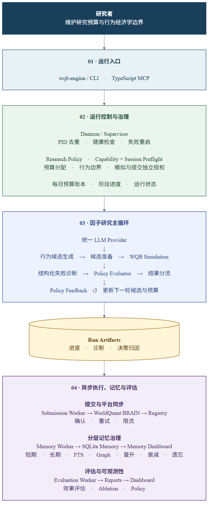

# WQB Agent Lab

面向 WorldQuant BRAIN 的因子研究 Agent。

[](https://github.com/paradoxSCH/wqb-agent-lab/actions/workflows/ci.yml)
[](docs/user/GETTING_STARTED.md)
[](LICENSE)

[快速开始](#快速开始) · [工作流](#工作流) · [文档](#文档) · [参与贡献](#参与贡献)

WQB Agent Lab 把行为经济学假设转化为可验证的 alpha 研究任务。用户维护研究预算和行为边界，Agent 负责候选生成、模拟编排、失败诊断、记忆治理、效果评估与提交队列。

项目提供可审计的研究工作流和治理能力，不包含可直接提交的 alpha 配方集合。

> Not affiliated with WorldQuant or WorldQuant BRAIN. This project does not guarantee alpha quality, platform acceptance, rewards, or profits. You are responsible for complying with platform terms and local laws.



## 核心能力

- **行为假设驱动**：从行为机制、WQB 字段代理和 kill conditions 生成可审计的研究候选。
- **预算化研究循环**：在模拟前完成 session、能力和研究政策预检，并按反馈调整后续预算。
- **结构化失败诊断**：把平台 check 升级为带数值分档的诊断对象，再交给 policy evaluator 决定修复、降级或换方向。
- **分层记忆治理**：运行证据经过晋升、衰减与遗忘治理，并通过全文检索和依赖图参与研究复盘。
- **模型无关**：统一 LLM Provider 支持 OpenAI-compatible、Anthropic、Gemini、Ollama 和 CLI Provider。
- **解耦执行**：挖掘、记忆、评估和提交 worker 独立运行，单个外部调用不会阻塞整个研究 loop。

## 快速开始

runtime 不要求预装 Python 或 Node.js。bootstrap 会检查 uv，并通过 uv 建立隔离的 Python 3.12 环境，不会覆盖系统已有的 Python；如果缺少 uv，它会给出官方安装来源和下一条命令。

```powershell
git clone https://github.com/paradoxSCH/wqb-agent-lab.git
cd wqb-agent-lab
powershell -ExecutionPolicy Bypass -File scripts/bootstrap.ps1 -Profile runtime
uv run python -m scripts.dev doctor --profile runtime --json
uv run wqb-engine demo --workspace-root . --run-tag product-demo
```

macOS 或 Linux 使用：

```bash
git clone https://github.com/paradoxSCH/wqb-agent-lab.git
cd wqb-agent-lab
sh scripts/bootstrap.sh --profile runtime
uv run python -m scripts.dev doctor --profile runtime --json
uv run wqb-engine demo --workspace-root . --run-tag product-demo
```

`demo` 只使用合成数据，不需要 WQB 账号或 LLM API key，真实 WQB 调用和提交尝试均为 `0`。结果写入 `.local/data/runs/continuous-alpha/product-demo/`。

如果 doctor 返回 `blocked`，请按 JSON 中的 `actions` 和 `next_command` 修复；不要绕过失败检查。全新电脑的安装说明和错误码见[首次安装](docs/user/GETTING_STARTED.md)与[故障排查](docs/user/TROUBLESHOOTING.md)。

## 连接 WQB

离线演示通过后，将公开配置复制到 `.local/`，再按文档填写研究预算、行为经济学边界和 LLM Provider：

```powershell
New-Item -ItemType Directory -Force .local\research\workflows | Out-Null
Copy-Item configs\examples\production-workflow.example.json .local\research\workflows\production.json
uv run wqb-engine policy.validate --config .local/research/workflows/production.json
uv run wqb-engine llm.validate --config .local/research/workflows/production.json
```

WQB 凭证和模型密钥只能写入项目根目录的 `.env`。真实平台副作用初始为关闭状态：

```env
WQB_LIVE_SIMULATION_CAPABILITY=0
WQB_LIVE_SUBMIT_CAPABILITY=0
```

模拟和提交是两项独立授权；启用前请先阅读[研究政策](docs/user/RESEARCH_POLICY.md)和[完整启动流程](docs/user/GETTING_STARTED.md)。公开示例、测试和 CI 不会开启这两个能力。

## 工作流

```text
行为经济学边界 + 研究预算
            ↓
假设与字段代理 → 候选生成 → 政策预检 → WQB 模拟
                                      ↓
记忆检索与治理 ← 策略反馈 ← 诊断与效果评估
                                      ↓
                              独立提交队列
```

每次研究运行生成完整证据链：输入政策、候选来源、预算消耗、平台结果、诊断决策、记忆变化和提交状态。架构所有权与依赖方向见[当前架构](docs/architecture/README.md)。

## 项目状态

当前版本为 `v0.1.1-alpha`，面向单用户 WorldQuant BRAIN 研究流程。Python 负责研究语义与平台边界；TypeScript MCP 和监控 UI 是可选接口。

项目依赖非官方的平台互操作接口，平台变更可能导致部分能力失效。首次公开版本优先保证可安装、可诊断、可审计，所有平台副作用均需显式授权；项目不承诺研究收益。

## 文档

| 主题 | 文档 |
| --- | --- |
| 安装、doctor 与首次运行 | [首次安装](docs/user/GETTING_STARTED.md) |
| 预算和行为经济学边界 | [研究政策](docs/user/RESEARCH_POLICY.md) |
| 模型与 CLI Provider 配置 | [LLM Providers](docs/user/LLM_PROVIDERS.md) |
| 当前模块和数据流 | [架构说明](docs/architecture/README.md) |
| 错误码与恢复方式 | [故障排查](docs/user/TROUBLESHOOTING.md) |
| 全部文档入口 | [文档索引](docs/README.md) |

## 参与贡献

开发 MCP、UI 或提交代码时使用 `full` profile：

```powershell
powershell -ExecutionPolicy Bypass -File scripts/bootstrap.ps1 -Profile full
uv run python -m scripts.dev check
uv run python -m scripts.dev test
```

提交 PR 前请阅读 [CONTRIBUTING.md](CONTRIBUTING.md) 和 [GOVERNANCE.md](GOVERNANCE.md)。安全问题请通过 GitHub Private Vulnerability Reporting 报告，详见 [SECURITY.md](SECURITY.md)。

## License And Citation

Software, schemas, tests, and machine-executable project files are licensed
under Apache-2.0. Documentation prose and visual assets are licensed under
CC BY 4.0. Code snippets in documentation remain Apache-2.0 unless marked
otherwise. See [LICENSE](LICENSE), [CC BY 4.0](LICENSES/CC-BY-4.0.txt), and
[NOTICE](NOTICE).

If this project materially influences a paper, article, course, architecture,
or another agent system, please credit WQB Agent Lab. [CITATION.cff](CITATION.cff)
contains machine-readable citation metadata. This citation request does not add a
restriction beyond the applicable licenses.
