# Current Architecture

WQB Agent Lab is a research system for WorldQuant BRAIN. Python owns quantitative research,
workflow state, policy, memory, evaluation, the WQB platform boundary, and the daemon
workbench. TypeScript owns the MCP protocol shell and an optional `run_summary` contract
consumer.

Workflow operations, including daemon completion hooks and dashboard projections, live
with the canonical workflow package rather than in a parallel application namespace.



## Dependency direction

```text
UI / MCP / commands
        |
        v
workflow -> research / memory / evaluation / governance / llm
        |
        v
wqb_agent_lab.platform
        |
        v
WorldQuant BRAIN transport
```

- `wqb_agent_lab.platform` is the canonical installed WQB client, model, readiness, and operator
  catalog boundary. Its research-session adapter, simulation helpers, and submission
  queue own platform-facing execution; generic result persistence lives in runtime.
- `wqb_agent_lab.workflow.ResearchWorkflow` is the public production orchestrator.
- Contracts, memory, evaluation, governance, research candidates, and runtime primitives
  are owned by `wqb_agent_lab`; canonical modules do not depend on the legacy `src` package.
- Alpha generation/refinement, behavioral-proxy analysis, self-correlation repair,
  scoring, loop validation, and policy-effectiveness analysis are canonical research or
  evaluation modules, not parallel implementations under `src`.
- `wqb_agent_lab.workflow.engine.ResearchWorkflow` owns production orchestration; its
  provider-neutral name replaces the historical provider-specific implementation name.
- Workflow artifact/provenance helpers, candidate selection, configuration rotation,
  submitted-registry snapshots, replay-safe memory/evaluation postprocessing, reporting,
  deterministic diagnosis/triage rules, immutable planning data, and the command-line
  adapter live in focused modules. They expose explicit functions or typed services
  instead of inheriting engine mixins; the engine retains stateful orchestration and
  stage sequencing.
- Removed compatibility namespaces and launchers are not part of the 0.3 runtime.
- Transport and MCP tools expose facts and capabilities. Governance decides budgets,
  retries, pauses, promotion, and side effects.
- Mutable runs, memory, credentials, scans, registries, logs, and PID files live under
  ignored local-state paths.

## Verification

The architecture boundaries are executable in `tests/test_architecture_boundaries.py` and
`tests/test_platform_boundary.py`. Developer and CI verification share `python -m scripts.dev`.

## Evolution

- [Open cognition / controlled execution](OPEN_COGNITION_CONTROLLED_EXECUTION.md) defines
  the incremental workflow migration and its LLM-capability guardrails.
- [ADR 0002](decisions/0002-open-cognition-controlled-execution.md) records why models
  propose actions while deterministic runtime code controls side effects.
